# M0 规格锁定

**产出窗口** M0 · **日期** 2026-08-07 · **依据** `docs/SPEC_DECISIONS.md` + `docs/FTS_飞行训练排班系统_工程化设计方案_v6.md`

本文件是 M0 的规格锁定产物，把 v6 的裁决落到**具体配置键与具体函数名**上，供 M1~M9 各窗口对照实现。
**本文件不产生新规格**——凡与 v6 冲突处，以 v6 为准。

---

## 1. S-01 ~ S-13 逐条落点

下表的「semantics.yaml 键名」列即 `rules/semantics.yaml` 中的实际路径；
「solver 侧」与「validator 侧」是**两套独立实现**的落点，**禁止共用约束表达代码**（CLAUDE.md 铁律 2）。

| ID | 裁定值 | semantics.yaml 键名 | solver 侧落点 | validator 侧落点 |
|---|---|---|---|---|
| **S-01** 先修「X类」达标条件 | 该类**全部**课目完成 | `switches.S-01.value = all_missions_completed` | `solver/candidates.py::prereq_met()` —— 类别展开后逐门比对已完成集；未达标不生成候选，记入 `blocked_items` | `validator/checks.py::check_c13()` 第二部分 —— 断言「先修未满足的课目在方案中出现次数 = 0」 |
| **S-02** 约束3 A 类粒度 | A 类**整体** ≥1 次（A-1 或 A-2 任一） | `switches.S-02.value = class_level` | `solver/model.py::add_c03_weekly_a_class()` —— `Σ x[c] ≥ 1 for c ∈ 学员 p 的全部 A 类候选`（A-1+A-2 合并计数） | `validator/checks.py::check_c03()` —— 按学员统计 A 类周计数 ≥1 |
| **S-03** 已完成课目是否复训 | 仅**未完成**课目受约束13 | `switches.S-03.value = incomplete_only` | `solver/model.py::add_c13_frequency()` 入口处 `if progress.status == "COMPLETED": continue` | `validator/checks.py::check_c13()` —— 从 PG 读完成状态，已完成者跳过窗口校验 |
| **S-04** 20 分钟窗口边界 | 半开 `[t, t+20)` | `switches.S-04.value = half_open` | `solver/model.py::add_c09_density()` —— `AddCumulative(len=20, cap=2)`，与半开窗等价 | `validator/checks.py::check_c09()` —— `sum(1 for u in ts if t <= u < t+20)` |
| **S-05** 跑道模型 | **双跑道**，按机型映射 | `switches.S-05.{model, runways, density_scope}` | `solver/model.py::add_runway_assignment()` + `add_c09_density()` —— 跑道是**决策变量**（`AddExactlyOne`） | `validator/checks.py::check_c09()` —— 先按 `Sortie.runway_id` 分组再计数 |
| **S-06** 周转基准 | 上一架次**着陆** → 下一架次**起飞** | `switches.S-06.value = landing_to_takeoff` | `solver/model.py::add_c07_turnaround()` —— `s[b] ≥ e[a] + T` | `validator/checks.py::check_c07()` —— `takeoff[b] − landing[a] ≥ T` |
| **S-07** 休息累计范围 | 仅**同日内**累计 | `switches.S-07.value = same_day_only` | `solver/model.py::add_c08_rest()` —— 序变量 `pos ∈ {1,2,3}`，同日分组 | `validator/checks.py::check_c08()` —— 按 (人, 日) 分组，**跨日不累计** |
| **S-08** 带飞适用对象 | 仅**学员**执行时需带飞 | `switches.S-08.value = students_only` | `solver/candidates.py::crew_composition()` —— 判定式 `需带飞 = (mission.带飞==是) ∧ (身份==学员)` | `validator/checks.py::check_c05()` —— 按判定式重算期望人数并比对 |
| **S-09** 教员/成熟飞行员排课 | 教员**不排**；成熟飞行员按 S-11 复训 | `switches.S-09.value = instructors_exempt_mature_recurrent` | `solver/candidates.py::enumerate()` —— 教员不生成受训候选，只占带飞教员岗 | `validator/checks.py::check_c04()` —— 断言学员未担任教员岗、教员未作为受训人出现 |
| **S-10** 空域容量 | **硬约束**，并入约束6 | `switches.S-10.value = hard_constraint` | `solver/model.py::add_c06_airspace_capacity()` —— 用**完整飞行区间**做 `AddCumulative` | `validator/checks.py::check_c06()` 第二部分 —— **扫描线**（起飞 +1 / 着陆 −1，取前缀最大值） |
| **S-11** 成熟飞行员到期资质 | 转**复训**，7 天滑窗，自到期次日起 | `switches.S-11.{enabled, applies_to_identities, window_days, start_offset_days}` | `solver/candidates.py::apply_s11()` —— 到期候选**不剔除**，标 `is_recurrent=True`；`model.py::add_c13_frequency()` 按 7 天滑窗 | `validator/checks.py::check_c02()` —— 对成熟飞行员按 S-11 判定而非字面约束2，并在报告中**显式标注为授权改写** |
| **S-12** 锚点缺失起算 | 视为窗口从**本周周一**起算，**不计欠账** | `switches.S-12.{value, count_as_debt}` + `frequency_anchor.missing_anchor_deadline` | `solver/model.py::add_c13_frequency()` —— `last_done_date is None → deadline = F − 1, is_debt = False` | `validator/checks.py::check_c13()` —— 独立重算同一分支 |
| **S-13** 约束3 适用范围 | 对**全部 4 名学员**生效，不论完成状态 | `switches.S-13.value = all_students` | `solver/model.py::add_c03_weekly_a_class()` —— 遍历全部学员，不过滤完成状态 | `validator/checks.py::check_c03()` —— 同上，遍历全部学员 |

> **跨周锚点通式（D-4）**：`first_exec_day ≤ max(0, freq_days − gap)`，其中 `gap = (week_monday − last_done_date).days`，`is_debt = gap ≥ freq_days`。
> `SPEC_DECISIONS §B.4` 第二分支的 `− 1` 为笔误，v6 已裁定统一取通式。落在 `rules/semantics.yaml::frequency_anchor`。

---

## 2. 14 条规则 → CP-SAT 编码 / 校验器独立实现 对照表

**照抄 v6 §3.2**，它已把空域容量（S-10）、双跑道（S-05）、频率滑窗（S-12/D-4）、`req_max`（约束14）全部合进去。
机器可读形态见 `rules/ruleset_v1.3.yaml`。

| 规则 | 分级 | 类型 | CP-SAT 编码 | 校验器独立实现 |
|---|---|---|---|---|
| **1** 时间一致性 | R0 | 结构性 | 区间变量构造保证 `end = start + dur`；域 `[0, 720−dur]`；按 day 分离。**本条在建模上结构性成立**，无需额外约束 | 逐条重算 `land == takeoff + duration`，比对训练窗 06:00-18:00，检查 day 一致 |
| **2** 人员可用性 | R0 | 预筛 | 候选枚举剔除 `day ∈ person.unavailable`、`day > qual.expiry`（到期日当日保留）。**S-11 例外**：成熟飞行员的到期资质不剔除，标 `is_recurrent` | 遍历架次×人员，查不可用表与资质到期表；**对成熟飞行员按 S-11 判定而非字面约束2**，并在报告中显式标注该条为授权改写 |
| **3** 角色配置 | R2 | 结构+线性 | 带飞候选构造为 (1 教员, 1 学员)，单飞候选为 (1 人)，编成由 §3.1.1 判定式决定；**S-02 + S-13**：`Σ x[c] ≥ 1` for c ∈ 学员 p 的**全部 A 类候选**，对全部 4 名学员生效 | 统计每个带飞架次教员数==1、学员数==1；单飞架次人数==1；对每名学员统计 A 类（A-1+A-2）周计数 ≥1 |
| **4** 资质匹配/岗位互斥 | R0 | 预筛+NoOverlap | 候选枚举保证资质；`AddNoOverlap([itv[c] for c 含人员 p])` | 查资质表；对每人做区间两两相交检测；断言学员未担任教员岗 |
| **5** 机型/机组编成 | R0 | 预筛 | 候选枚举保证：机组每人持机型资质；带飞人数=2、单飞/复训人数=1；人数 ≤ 座位数(2) | 查机型资质、人数、座位数，按 §3.1.1 判定式重算期望人数并比对 |
| **6** 资源有效性**与容量** | R0 | 预筛 + Cumulative | ① 机号 ∈ 在册列表 且 机型 ∈ 课目适配（预筛）<br>② **空域容量**：用**完整飞行区间** `[start, start+dur]` 做 `AddCumulative(demands=[1]*n, capacity=cap)` | ① 机号与机型比对；② **按空域分组做扫描线**，断言任意时刻并发 ≤ 容量。**禁止复用 solver 的区间对象** |
| **7** 飞机冲突+周转 | R0 | 析取 | 同机候选两两 reified：`x[a]∧x[b] → (s[b] ≥ e[a]+T) ∨ (s[a] ≥ e[b]+T)`，**T 按 S-06 从着陆算到起飞**；维护时段作为固定区间加入该机 NoOverlap | 按机分组排序，逐对检查 `takeoff[b] − landing[a] ≥ T`（JL-8=30 / JL-9=40）与维护窗重叠 |
| **8** 人员冲突+休息 | R0 | 析取+序 | 同人**同日**（S-07）两两间隔 ≥10；用序变量 `pos[c] ∈ {1,2,3}`，令 `pos=3` 者与 `pos=2` 者间隔 ≥30 | 按人按日排序，检查相邻间隔 ≥10、第 2→第 3 间隔 ≥30；**跨日不累计** |
| **9** 起降密度 | R0 | Cumulative | ① 跑道分配变量 `AddExactlyOne`；② **20 分钟窗口按 (day, runway) 分组** `AddCumulative(len=20, cap=2)`；③ **7 分钟间隔全场按 day** `AddCumulative(len=7, cap=1)` | **按日、按跑道**做 20 分钟滑窗计数 ≤2；**按日全场**排序检查相邻起飞时刻差 ≥7 |
| **10** 每日时长上限 | R1 | 线性 | `Σ x[c]·dur[c] ≤ 480`（学员 240），按 (person, day) 分组 | 分组求和比对 |
| **11** 每周架次上限 | R1 | 线性 | `Σ x[c] ≤ 12`（学员 10），按 person 分组 | 分组计数 |
| **12** 每日架次上限 | R1 | 线性 | `Σ x[c] ≤ 3` per (person, day)；`≤ 6` per (aircraft, day) | 分组计数 |
| **13** 任务完成度 | R2 | **滑动窗口**+跨周 | 对每个 (学员, 未完成且先修满足的课目)：**任意连续 `freq_days` 天窗口内 `Σ x ≥ 1`**；跨周锚点见 §1 通式；先修未满足者不生成候选；已完成课目 (S-03) 不受本条约束；**S-11** 成熟飞行员到期资质按 7 天滑窗同受本条 | 独立重算窗口约束（从 PG 读 `last_done_date` 与完成状态），逐窗口比对；并断言「先修未满足的课目出现次数 = 0」 |
| **14** 任务唯一性 | *(待裁定，见下)* | 线性+去重 | `Σ x[c] ≤ req_max` per (person, mission)，**`req_max = ceil(7 / freq_days)`**（A 类 = 3，B~H 类 = 1）；候选集按 (person, mission, day) 唯一 | 输出记录完全重复检测 + 每 (person, mission) 计数上界检测，`req_max` 独立重算 |

> ⚠️ **约束14 的分级在 v6 §3.10 中缺失。** §3.10 只列了 R0(1,2,4,5,6,7,8,9) / R1(10,11,12) / R2(3,13)，**没有给约束14 定级**。
> 本窗口实现为 `tier: null, relaxable: false, tier_pending_decision: true`（`rules/ruleset_v1.3.yaml`）。
> **这个取值不改变任何排班结果**——松弛阶梯 Tier 0~3 从未松弛过约束14，四档下行为完全一致。待业务方补一条正式分级。

### 松弛阶梯（v6 §3.10，D-6 已重定义 Tier 2）

```
Tier 0  全硬约束
Tier 1  约束13 的频率窗口降级为软目标（允许欠账，最大化完成度）
Tier 2  Tier1 + 约束3「A 类每周必飞」整体降级为软目标        ← D-6 重定义
Tier 3  Tier2 + 经授权放宽 R1（约束10/11/12，需人工审批后执行）
```

**无论松弛到哪一级，R0 恒满足。** 这是 v6 §0.3「输出方案 100% 合规」在松弛场景下依然成立的依据。
`rules/ruleset_v1.3.yaml::relaxation_ladder` 已固化，并由 `tests/unit/test_rules_yaml.py::test_ladder_never_relaxes_r0` 断言任何一档都不触碰 R0。

---

## 3. 数据模型 ER 图

覆盖 PG 全部表。**建表迁移由 M1 窗口交付**（`alembic/versions/`）；本节是 M1 的实现依据。

```mermaid
erDiagram
    SNAPSHOT ||--o{ PERSON            : contains
    SNAPSHOT ||--o{ AIRCRAFT          : contains
    SNAPSHOT ||--o{ MISSION           : contains
    SNAPSHOT ||--o{ AIRSPACE          : contains
    SNAPSHOT ||--o{ RUNWAY            : contains
    SNAPSHOT ||--o{ TRAINING_PROGRESS : contains
    SNAPSHOT ||--o{ SCHEDULE_PLAN     : "bound by data_snapshot_id"

    PERSON   ||--o{ PERSON_QUAL       : holds
    PERSON   ||--o{ PERSON_UNAVAIL    : has
    PERSON   ||--o{ TRAINING_PROGRESS : tracks
    PERSON   ||--o{ SORTIE_CREW       : crews

    AIRCRAFT ||--o{ MAINTENANCE       : scheduled
    AIRCRAFT ||--o{ SORTIE            : flies
    AIRCRAFT }o--|| AIRCRAFT_TYPE     : "JL-8 / JL-9"

    MISSION  ||--o{ MISSION_PREREQ    : requires
    MISSION  }o--|| AIRSPACE          : "bound airspace"
    MISSION  ||--o{ SORTIE            : realized_as
    MISSION  ||--o{ TRAINING_PROGRESS : tracks

    RUNWAY   ||--o{ RUNWAY_TYPE_MAP   : serves
    RUNWAY   ||--o{ SORTIE            : "runway_id (决策变量)"

    SCHEDULE_PLAN ||--o{ SORTIE        : contains
    SCHEDULE_PLAN ||--o{ TRAINING_DEBT : discloses
    SCHEDULE_PLAN ||--o{ BLOCKED_ITEM  : discloses
    SCHEDULE_PLAN }o--|| RULESET_VERSION   : "ruleset_version"
    SCHEDULE_PLAN }o--|| SEMANTICS_VERSION : "semantics_version"

    SORTIE   ||--o{ SORTIE_CREW       : has

    RUN      ||--o{ TRACE_EVENT       : records
    RUN      ||--o{ ERROR_ITEM        : records
    RUN      ||--o| HUMAN_DECISION    : gated_by
    RUN      }o--|| SCHEDULE_PLAN     : produces
    RUN      ||--o{ AUDIT_LOG         : writes

    PERSON {
        text person_id PK "P01~P08"
        text name
        text identity "教员/成熟飞行员/学员"
        text snapshot_id FK
    }
    PERSON_QUAL {
        text person_id FK
        text qual_class "A~H / 机型"
        text level "教员/单飞/带飞"
        date expiry_date "刘斌 C 类 = 2026-01-07"
    }
    AIRCRAFT {
        text aircraft_id PK "AC10..AC95"
        text type "JL-8 / JL-9"
        int  seats "2"
        int  turnaround_min "JL-8=30 / JL-9=40"
        time window_start "06:00"
        time window_end "18:00"
    }
    MISSION {
        text mission_id PK "missionA-1 .. missionH-1"
        text name
        int  duration_min
        int  freq_days "A=3 / B~F=7 / G,H=14"
        int  req_max "ceil(7/freq_days)"
        bool dual_required "带飞列"
        text airspace_id FK
    }
    AIRSPACE {
        text airspace_id PK "SAA/SAB/IFR/RT1/RT2/RNG"
        text name
        int  capacity "同时段容量 2/2/1/1/1/1"
    }
    RUNWAY {
        text runway_id PK "RWY-1 / RWY-2"
    }
    RUNWAY_TYPE_MAP {
        text runway_id FK
        text aircraft_type "RWY-1:{JL-8,JL-9} RWY-2:{JL-8}"
    }
    TRAINING_PROGRESS {
        text person_id FK
        text mission_id FK
        text status "COMPLETED/IN_PROGRESS/NOT_STARTED"
        date last_done_date "NULL → S-12 从本周周一起算"
        int  debt_count
        bool prereq_met
        bool is_recurrent "S-11 复训标记"
        date recurrent_since "S-11 到期次日"
    }
    SORTIE {
        text sortie_id PK "S000001"
        text plan_id FK
        date date
        time takeoff
        time landing
        text mission_id FK
        text aircraft_id FK
        text runway_id FK "S-05 决策变量"
        text airspace_id FK
        bool is_recurrent "S-11"
    }
    SORTIE_CREW {
        text sortie_id FK
        text person_id FK
        text role "教员/学员/单飞/复训"
    }
    SCHEDULE_PLAN {
        text plan_id PK
        text iso_week "2026W02"
        date week_start
        date week_end
        text snapshot_id FK
        text ruleset_version
        text semantics_version
        jsonb semantics_switches "S-01~S-13 取值快照"
        text runway_model
        int  relaxation_tier
        text content_sha256
    }
```



**三处 v6 新增字段必须落库**：`RUNWAY` / `RUNWAY_TYPE_MAP` 两张表、`AIRSPACE.capacity`、
`TRAINING_PROGRESS.is_recurrent` 与 `.recurrent_since`、`SORTIE.runway_id` 与 `.is_recurrent`、
`SCHEDULE_PLAN.semantics_switches` 与 `.runway_model`。

---

## 4. 基准周实体全景落库核对表（v6 §1.3）

M1 摄取完成后须逐格核对。**数值逐字来自 `data/origin/*.pdf`，冲突处按 v6 §1.2 裁定。**

### 4.1 人员（8 人 = 3 教员 + 1 成熟飞行员 + 4 学员）

| 编号 | 姓名 | 身份 | 机型资质 | 已完成课目 | 类别资质/等级 | 复训到期 | 不可用日期 |
|---|---|---|---|---|---|---|---|
| P01 | 孙军 | 教员 | JL-8, JL-9 | 全 12 门 | A~H 类 / 教员 | — | — |
| P02 | 高超 | 教员 | JL-8, JL-9 | 全 12 门 | A~H 类 / 教员 | — | — |
| P03 | 吴鹏 | 教员 | JL-8, JL-9 | 全 12 门 | A~H 类 / 教员 | — | **2026-01-05** |
| P04 | 刘斌 | 成熟飞行员 | JL-8, JL-9 | 全 12 门 | A~H 类 / 单飞 | **C 类 2026-01-07** | — |
| P05 | 罗磊 | 学员 | JL-8 | A-1, A-2, B-1, B-2, C-1 | A/单飞；B、C、F/带飞 | — | — |
| P06 | 张勇 | 学员 | JL-8 | A-1, A-2 | A/单飞；B、C、F/带飞 | — | — |
| P07 | 陈伟 | 学员 | JL-8 | A-1, A-2, B-1 | A/单飞；B、C、F/带飞 | — | — |
| P08 | 何超 | 学员 | JL-8 | A-1 | A/单飞；B、C、F/带飞 | — | — |

> 学员 A 类等级为「单飞」是 D-1 对 `personnel.pdf` 的更正，与 `missions.pdf` 中 A-1/A-2 的「带飞=否」一致。

### 4.2 飞机（8 架：JL-8 六架 + JL-9 两架）

| 机号 | 机型 | 座位 | 每日可用窗 | 周转(分) | 维护计划 |
|---|---|---|---|---|---|
| AC10 / AC27 / AC34 / AC49 / AC61 | JL-8 | 2 | 06:00-18:00 | 30 | — |
| **AC73** | **JL-8** | 2 | 06:00-18:00 | 30 | **2026-01-09 全天定检** |
| AC84 / AC95 | JL-9 | 2 | 06:00-18:00 | 40 | — |

> ⚠️ **AC73 是 JL-8，不是 JL-9**（v6 更正 F2）。**JL-9 只有 AC84/AC95 两架**（F1）。

### 4.3 课目（12 门）

| 课目 | 名称 | 时长(分) | freq_days | req_max | 先修 | 带飞 | 机型 | 空域 |
|---|---|---|---|---|---|---|---|---|
| missionA-1 | 本场起落航线 | 30 | 3 | 3 | — | **否** | JL-8 | SAA |
| missionA-2 | 本场起落航线 | 27 | 3 | 3 | — | **否** | JL-8 | SAB |
| missionB-1 | 导航飞行 | 52 | 7 | 1 | A 类 | 是 | JL-8/JL-9 | RT2 |
| missionB-2 | 导航飞行 | 54 | 7 | 1 | A 类 | 是 | JL-8/JL-9 | RT1 |
| missionC-1 | 仪表飞行 | 35 | 7 | 1 | A 类 | 是 | JL-8/JL-9 | IFR |
| missionC-2 | 仪表飞行 | 56 | 7 | 1 | missionC-1 | 是 | JL-8/JL-9 | IFR |
| missionD-1 | 轰炸与射击 | 26 | 7 | 1 | B 类、C 类 | 是 | JL-9 | RNG |
| missionE-1 | 空战机动 | 46 | 7 | 1 | C 类 | 是 | JL-9 | SAA |
| missionE-2 | 空战机动 | 69 | 7 | 1 | missionE-1 | 是 | JL-9 | SAA |
| missionF-1 | 编队飞行 | 40 | 7 | 1 | A 类 | 是 | JL-8/JL-9 | SAB |
| missionG-1 | 特技飞行 | 35 | 14 | 1 | A 类、F 类 | 是 | JL-9 | SAB |
| missionH-1 | 低空突防 | 50 | 14 | 1 | B 类 | 是 | JL-9 | RT1 |

> **学员只持 JL-8 机型资质与 A/B/C/F 四类资质** → D-1/E-1/E-2/G-1/H-1 五门（机型均为 JL-9 且分属 D/E/G/H 类）**双重排除，不生成任何学员候选**。
> 学员可及课目集 = `{A-1, A-2, B-1, B-2, C-1, C-2, F-1}`。

### 4.4 空域（6 个）

| 空域编号 | 名称 | 同时段容量 | 绑定课目 |
|---|---|---|---|
| SAA | Small Area A | 2 | missionA-1、missionE-1、missionE-2 |
| SAB | Small Area B | 2 | missionA-2、missionF-1、missionG-1 |
| IFR | IFR Route | 1 | missionC-1、missionC-2 |
| RT1 | Route 1 | 1 | missionB-2、missionH-1 |
| RT2 | Route 2 | 1 | missionB-1 |
| RNG | Range Area | 1 | missionD-1 |

### 4.5 跑道（2 条）

| 跑道 | 服务机型 | 可用机号 |
|---|---|---|
| `RWY-1` | JL-8, JL-9 | AC10, AC27, AC34, AC49, AC61, AC73, AC84, AC95 |
| `RWY-2` | JL-8 | AC10, AC27, AC34, AC49, AC61, AC73 |

JL-9 架次固定使用 RWY-1；**JL-8 架次的跑道由求解器选择**。
密度口径（D-2）：20 分钟窗口 `per_runway`，7 分钟间隔 `airport_wide`。

### 4.6 落库核对清单

| 实体 | 期望条数 | 核对要点 |
|---|---|---|
| 人员 | **8** | 身份分布 3/1/4；P03 带 1 条不可用记录；P04 带 C 类到期日 2026-01-07 |
| 人员资质 | 每人机型 + 类别若干 | 学员 A 类等级须为「单飞」（D-1 一致性断言，不符即 FTS-2001 阻断） |
| 飞机 | **8** | JL-8 六架 / JL-9 两架；AC73 为 **JL-8**；AC73 带 1 条 2026-01-09 全天维护 |
| 课目 | **12** | `freq_days` 与 `req_max` 按 §4.3；A-1/A-2 的 `dual_required = false` |
| 空域 | **6** | `capacity` 分别为 2/2/1/1/1/1 |
| 跑道 | **2** | `RUNWAY_TYPE_MAP` 共 3 行（RWY-1×2 机型 + RWY-2×1 机型） |
| 训练进度 | 学员 × 可及课目 | `last_done_date` **全部为 NULL**（原始 PDF 未提供该字段）→ 按 S-12 处理，**不得写成 gap=999** |

---

## 5. 基准周 2026W02 已知扰动清单

**ISO 周 2026W02，覆盖 2026-01-05（周一）~ 2026-01-11（周日）。**
三项扰动**均来自原始 PDF，非人为构造**：

| # | 扰动 | 生效范围 | 影响的规则 | 建模落点 |
|---|---|---|---|---|
| 1 | **吴鹏（P03）2026-01-05 不可用** | 单日，仅该人 | 约束2 | 候选枚举剔除 `(P03, day=0, *)`；当日可用教员降为 2 人 |
| 2 | **AC73 2026-01-09 00:00-23:59 全天定检** | 单日，仅该机 | 约束2 / 约束7 | 候选枚举剔除 `(*, day=4, AC73)`；当日 JL-8 可用机降为 5 架 |
| 3 | **刘斌（P04）C 类仪表等级 2026-01-07 到期** | 自 01-08 起 | 约束2（**S-11 授权改写**） | 候选**不剔除**，标 `is_recurrent=True`；复训窗口 `[2026-01-08, 2026-01-14]` **跨出 W02，本周不强制**，但 `training_progress` 必须写入锚点使下周能接续 |

### 5.1 阻塞项预期（7 条，v6 §1.4.2）

按 S-01（类达标 = 该类全部课目完成）推导，**全部须出现在 Sheet 4 区块 4**：

| 学员 | BLOCKED 项 | 缺失先修 |
|---|---|---|
| 张勇 P06 | C-2 | missionC-1 |
| 陈伟 P07 | C-2 | missionC-1 |
| 何超 P08 | B-1、B-2、C-1、F-1 | missionA-2（A 类未达标） |
| 何超 P08 | C-2 | missionC-1（且 A 类未达标） |

**合计 7 条。** 罗磊 P05 无阻塞项。

### 5.2 求解状态预期

v6 §1.4 的**纸面推演**为 **OPTIMAL**（约 14 架次 = 9 带飞 + 5 单飞；教员容量 36 架次，资源全面富余）。

> ⚠️ **两条边界，M2 窗口必须照做**：
> ① 本节任何数字都是纸面推演，**不得作为实测指标写入验收报告**（CLAUDE.md 铁律 6）。实测以 M2a 为准。
> ② 若 M2 实测下基准周判定 **INFEASIBLE**，按 CLAUDE.md §7 第 4 条**立刻停下来报告业务方，绝对不许通过放宽任何硬约束让它可解**。
> ③ `SPEC_DECISIONS §B.4` 末尾「A 类 3 天滑窗 → 16~24 带飞架次 → 基准周可能 INFEASIBLE」的风险预警，**建立在「A 类需教员带飞」这个已被 D-1 推翻的前提上，自 v6 起作废**。

---

## 6. 本窗口发现、需业务方补裁的事项

| # | 事项 | 现状处理 | 是否影响排班结果 |
|---|---|---|---|
| 1 | **v6 §3.10 未给约束14（任务唯一性）分级** | 实现为 `tier: null, relaxable: false, tier_pending_decision: true` | **否**——松弛阶梯 Tier 0~3 从未松弛它，四档行为一致 |

其余 S-01~S-13 **全部可唯一映射为配置项**，无需补裁。
